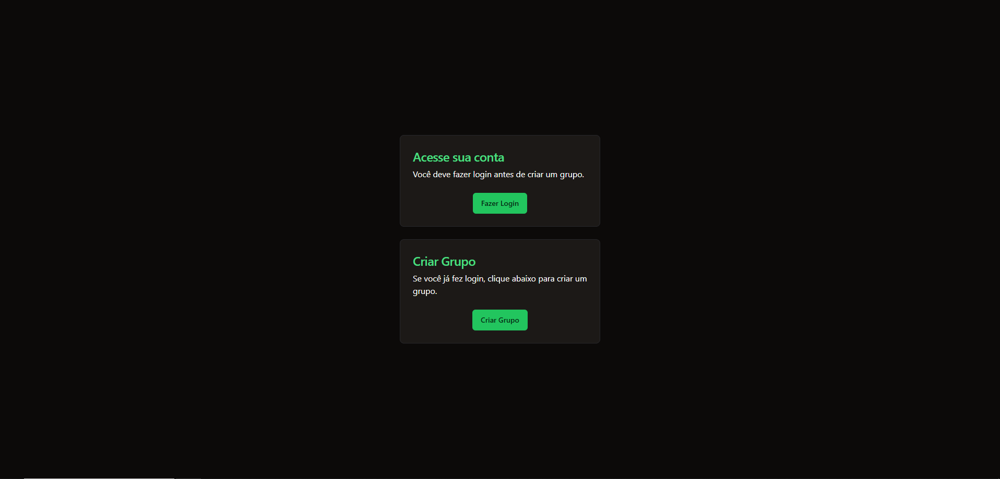
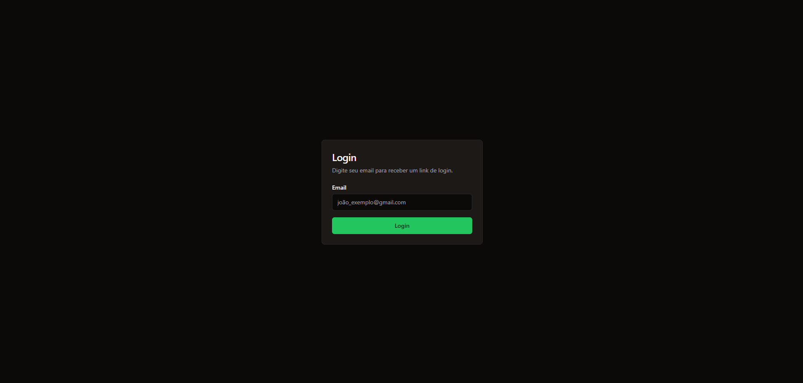
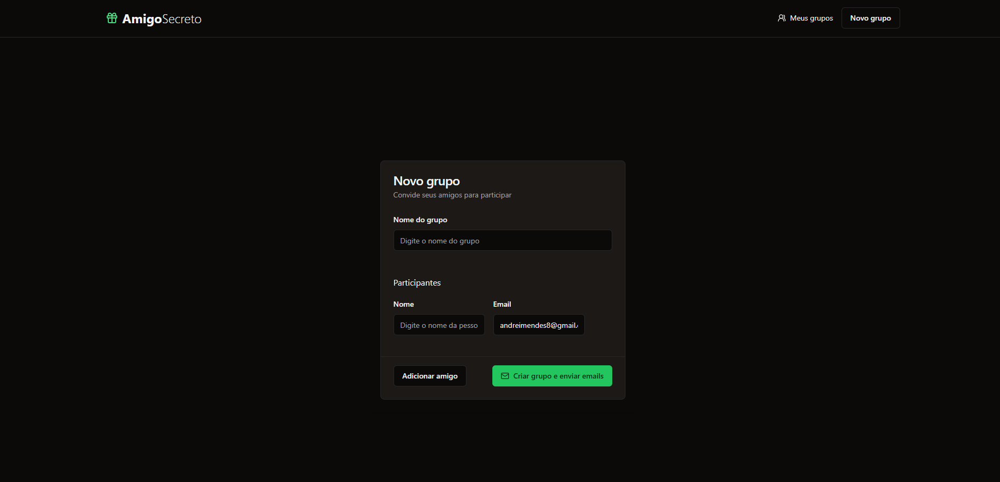
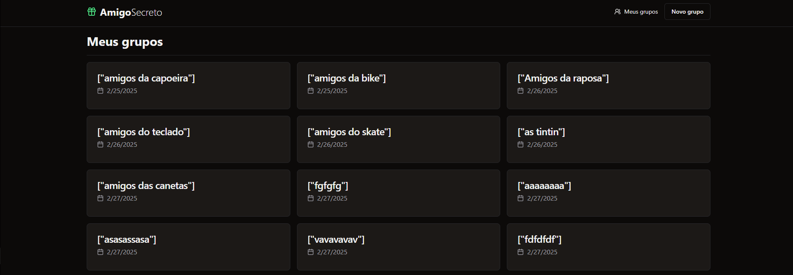

# 🎁 Amigo Secreto  

O projeto **Amigo Secreto** foi desenvolvido para aprimorar minhas habilidades em Next.js, gerenciamento de estado e manipulação de dados. Além disso, explorei técnicas de responsividade, autenticação e banco de dados para um sistema funcional e intuitivo.  

## 🚀 Tecnologias Utilizadas  

- **Frontend & Backend:** Next.js, Node.js, TypeScript  
- **Estilização:** Tailwind CSS, Shadcn/UI, Aceternity UI  
- **Banco de Dados:** Supabase (SQL)  
- **Autenticação:** Supabase (Magic Link)  
- **Envio de E-mails:** Resend  

---

## ✨ Funcionalidades  

✅ Criar grupos de Amigo Secreto  
✅ Adicionar participantes (nome e e-mail)  
✅ Realizar o sorteio automático  
✅ Enviar o resultado por e-mail  
✅ Interface simples e responsiva  
✅ Autenticação com Supabase  
✅ Gerenciamento dos sorteios no banco de dados  
✅ Configuração de temas personalizados (Shadcn/UI)  
✅ Integração com Resend para envio de e-mails  

---

## 🏗 Estrutura do Projeto  

### **Next.js**  
✔ Criação de rotas  
✔ Criação de componentes reutilizáveis  
✔ Uso de Server Components e Server Actions  
✔ Gerenciamento de autenticação e dados com Supabase  

### **Shadcn/UI & Aceternity UI**  
✔ Instalação e configuração de componentes  
✔ Customização de temas e UI moderna  

### **Supabase**  
✔ Autenticação segura com Supabase  
✔ Suporte a Magic Link para login  
✔ Gerenciamento e persistência de dados  
✔ Conexão otimizada com Next.js  

### **Resend**  
✔ Configuração e integração no Next.js  
✔ Envio automático de e-mails com os resultados do sorteio  

**Tela Inicial**

**Tela Login**

**Cração de Grupos**

**Grupos que participo**


---

## ⚙️ Como Rodar o Projeto  

1️⃣ **Clone o repositório:**  
```bash
git clone https://github.com/seu-usuario/amigo-secreto.git
```
2️⃣ Instale as dependências:
```bash
npm install
```

3️⃣ Configuração das variáveis de ambiente:
```bash
Crie um arquivo .env.local na raiz do projeto e adicione:
NEXT_PUBLIC_SUPABASE_URL=your_supabase_url
NEXT_PUBLIC_SUPABASE_ANON_KEY=your_supabase_anon_key
SUPABASE_SERVICE_ROLE_KEY=your_supabase_service_role_key
RESEND_API_KEY=your_resend_api_key
```

4️⃣ Execute o projeto:
```bash
npm run dev
```

5️⃣ Acesse em:
```bash
http://localhost:3000 🚀
```


